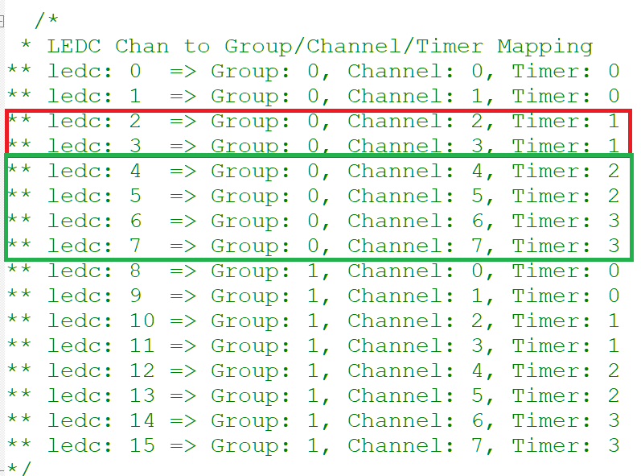

# ESP32CAM_control_servo

使用 ESP32CAM 當控制板，搭配 esp motor shield 來控制四顆伺服馬達 
控制軟體為嵐奕科技的 V7RC
- 手機需先安裝 V7RC，採用 BLE 和 ESP32CAM 連線來控制，控制介面為"坦克模式"  

用 ESP32CAM 需注意要避開 CAM 用的 timer 1   
所以 LEDC 我用的是 channel 4/5/6/7   

以下為查到的 LEDC channel 和 timer 的對應表 

